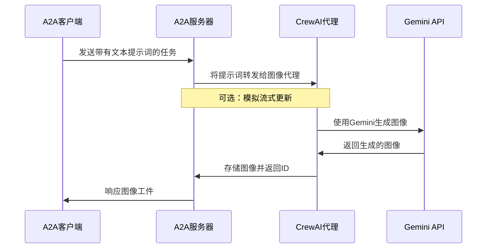

## 基于A2A协议的CrewAI代理

此示例演示了一个使用[CrewAI](https://www.crewai.com/open-source)构建并通过A2A协议暴露的简单图像生成代理。

## 工作原理

此代理利用CrewAI和Google Gemini API基于文本提示词生成图像。A2A协议实现了与代理的标准化交互，允许客户端发送请求并接收图像作为工件。



## 核心组件

- **CrewAI代理**：具有专门工具的图像生成代理
- **A2A服务器**：提供与代理交互的标准化协议
- **图像生成**：使用Gemini API从文本描述创建图像
- **缓存系统**：存储生成的图像以供检索（内存或基于文件）

## 前置要求

- Python 3.12或更高版本
- [UV](https://docs.astral.sh/uv/)包管理器（推荐）
- Google API密钥（用于Gemini访问）

## 设置和运行

1. 导航到示例目录：

   ```bash
   cd samples/python/agents/crewai
   ```

2. 使用您的API密钥创建环境文件（或Vertex AI凭据）：

   ```bash
   echo "GOOGLE_API_KEY=your_api_key_here" > .env
   ```

3. 设置Python环境：

   ```bash
   uv python pin 3.12
   uv venv
   source .venv/bin/activate
   ```

4. 使用所需选项运行代理：

   ```bash
   # 基本运行
   uv run .

   # 在自定义主机/端口上
   uv run . --host 0.0.0.0 --port 8080
   ```

5. 运行A2A客户端：

   在单独的终端中：
   ```bash
   # 连接到代理（指定正确的端口代理URL）
   cd samples/python/hosts/cli   
   uv run . --agent http://localhost:10001
   
   # 如果您在启动代理时更改了端口，请使用该端口
   # uv run . --agent http://localhost:YOUR_PORT
   ```

   或运行[演示应用](/A2A/A2A/demo/README.md)

## 功能和改进

**功能：**

- 使用Google Gemini进行文本到图像生成
- 支持使用参考修改现有图像
- 具有自动重试的强大错误处理
- 可选的基于文件的缓存持久化
- 改进了从查询中提取工件ID

**限制：**

- 没有真正的流式传输（CrewAI本身不支持）
- 有限的代理交互（没有多轮对话）

## 了解更多

- [A2A协议文档](https://google.github.io/A2A/#/documentation)
- [CrewAI文档](https://docs.crewai.com/introduction)
- [Google Gemini API](https://ai.google.dev/gemini-api)
