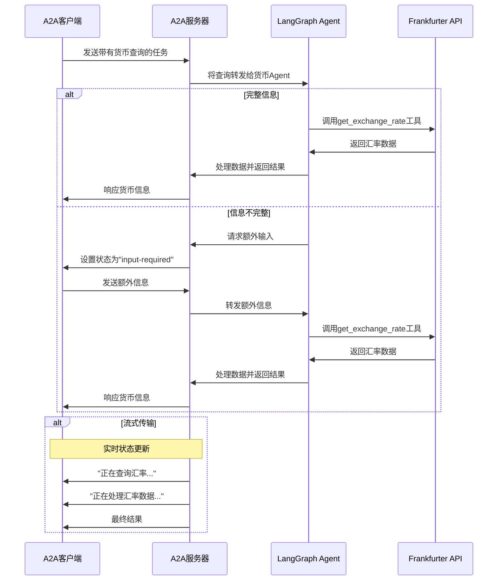

# 基于A2A协议的LangGraph货币Agent

此示例演示了一个使用[LangGraph](https://langchain-ai.github.io/langgraph/)构建并通过A2A协议暴露的货币转换Agent。它展示了支持多轮对话和流式响应的对话交互。

## 工作原理

此Agent使用LangGraph和Google Gemini通过ReAct Agent模式提供货币汇率信息。A2A协议实现了与Agent的标准化交互，允许客户端发送请求并接收实时更新。



## 核心功能

- **多轮对话**: Agent可以在需要时请求额外信息
- **实时流式传输**: 在处理过程中提供状态更新
- **推送通知**: 支持基于webhook的通知
- **对话记忆**: 在交互过程中维护上下文
- **货币汇率工具**: 集成Frankfurter API获取实时汇率

## 前置要求

- Python 3.13或更高版本
- [UV](https://docs.astral.sh/uv/)
- 访问LLM和API密钥

## 设置和运行

1. 导航到示例目录：

   ```bash
   cd samples/python/agents/langgraph
   ```

2. 使用您的API密钥创建环境文件：

   ```bash
   echo "GOOGLE_API_KEY=your_api_key_here" > .env
   ```

3. 运行Agent：

   ```bash
   # 在默认端口10000上基本运行
   uv run .

   # 在自定义主机/端口上
   uv run . --host 0.0.0.0 --port 8080
   ```

4. 在单独的终端中，运行A2A[客户端](/samples/python/hosts/README.md)：

   ```bash
   cd samples/python/hosts/cli
   uv run .
   ```

## 技术实现

- **LangGraph ReAct Agent**: 使用ReAct模式进行推理和工具使用
- **流式传输支持**: 在处理过程中提供增量更新
- **检查点记忆**: 在轮次之间维护对话状态
- **推送通知系统**: 基于webhook的更新，支持JWK认证
- **A2A协议集成**: 完全符合A2A规范

## 限制

- 仅支持基于文本的输入/输出（无多模态支持）
- 使用Frankfurter API，货币选项有限
- 内存基于会话，在服务器重启之间不持久化

## 示例

**同步请求**

请求：

```
POST http://localhost:10000
Content-Type: application/json

{
  "jsonrpc": "2.0",
  "id": 11,
  "method": "tasks/send",
  "params": {
    "id": "129",
    "sessionId": "8f01f3d172cd4396a0e535ae8aec6687",
    "acceptedOutputModes": [
      "text"
    ],
    "message": {
      "role": "user",
      "parts": [
        {
          "type": "text",
          "text": "1 USD兑换INR的汇率是多少？"
        }
      ]
    }
  }
}
```

响应：

```
{
  "jsonrpc": "2.0",
  "id": 11,
  "result": {
    "id": "129",
    "status": {
      "state": "completed",
      "timestamp": "2025-04-02T16:53:29.301828"
    },
    "artifacts": [
      {
        "parts": [
          {
            "type": "text",
            "text": "1 USD兑换INR的汇率是85.49。"
          }
        ],
        "index": 0
      }
    ],
    "history": []
  }
}
```

**多轮示例**

请求 - 序列1：

```
POST http://localhost:10000
Content-Type: application/json

{
  "jsonrpc": "2.0",
  "id": 10,
  "method": "tasks/send",
  "params": {
    "id": "130",
    "sessionId": "a9bb617f2cd94bd585da0f88ce2ddba2",
    "acceptedOutputModes": [
      "text"
    ],
    "message": {
      "role": "user",
      "parts": [
        {
          "type": "text",
          "text": "1 USD的汇率是多少？"
        }
      ]
    }
  }
}
```

响应 - 序列2：

```
{
  "jsonrpc": "2.0",
  "id": 10,
  "result": {
    "id": "130",
    "status": {
      "state": "input-required",
      "message": {
        "role": "agent",
        "parts": [
          {
            "type": "text",
            "text": "Which currency do you want to convert to? Also, do you want the latest exchange rate or a specific date?"
          }
        ]
      },
      "timestamp": "2025-04-02T16:57:02.336787"
    },
    "history": []
  }
}
```

Request - Seq 3:

```
POST http://localhost:10000
Content-Type: application/json

{
  "jsonrpc": "2.0",
  "id": 10,
  "method": "tasks/send",
  "params": {
    "id": "130",
    "sessionId": "a9bb617f2cd94bd585da0f88ce2ddba2",
    "acceptedOutputModes": [
      "text"
    ],
    "message": {
      "role": "user",
      "parts": [
        {
          "type": "text",
          "text": "CAD"
        }
      ]
    }
  }
}
```

Response - Seq 4:

```
{
  "jsonrpc": "2.0",
  "id": 10,
  "result": {
    "id": "130",
    "status": {
      "state": "completed",
      "timestamp": "2025-04-02T16:57:40.033328"
    },
    "artifacts": [
      {
        "parts": [
          {
            "type": "text",
            "text": "The current exchange rate is 1 USD = 1.4328 CAD."
          }
        ],
        "index": 0
      }
    ],
    "history": []
  }
}
```

**Streaming example**

Request:

```
{
  "jsonrpc": "2.0",
  "id": 12,
  "method": "tasks/sendSubscribe",
  "params": {
    "id": "131",
    "sessionId": "cebd704d0ddd4e8aa646aeb123d60614",
    "acceptedOutputModes": [
      "text"
    ],
    "message": {
      "role": "user",
      "parts": [
        {
          "type": "text",
          "text": "How much is 100 USD in GBP?"
        }
      ]
    }
  }
}
```

Response:

```
data: {"jsonrpc":"2.0","id":12,"result":{"id":"131","status":{"state":"working","message":{"role":"agent","parts":[{"type":"text","text":"Looking up the exchange rates..."}]},"timestamp":"2025-04-02T16:59:34.578939"},"final":false}}

data: {"jsonrpc":"2.0","id":12,"result":{"id":"131","status":{"state":"working","message":{"role":"agent","parts":[{"type":"text","text":"Processing the exchange rates.."}]},"timestamp":"2025-04-02T16:59:34.737052"},"final":false}}

data: {"jsonrpc":"2.0","id":12,"result":{"id":"131","artifact":{"parts":[{"type":"text","text":"Based on the current exchange rate, 1 USD is equivalent to 0.77252 GBP. Therefore, 100 USD would be approximately 77.252 GBP."}],"index":0,"append":false}}}

data: {"jsonrpc":"2.0","id":12,"result":{"id":"131","status":{"state":"completed","timestamp":"2025-04-02T16:59:35.331844"},"final":true}}
```

## Learn More

- [A2A Protocol Documentation](https://google.github.io/A2A/#/documentation)
- [LangGraph Documentation](https://langchain-ai.github.io/langgraph/)
- [Frankfurter API](https://www.frankfurter.app/docs/)
- [Google Gemini API](https://ai.google.dev/gemini-api)
