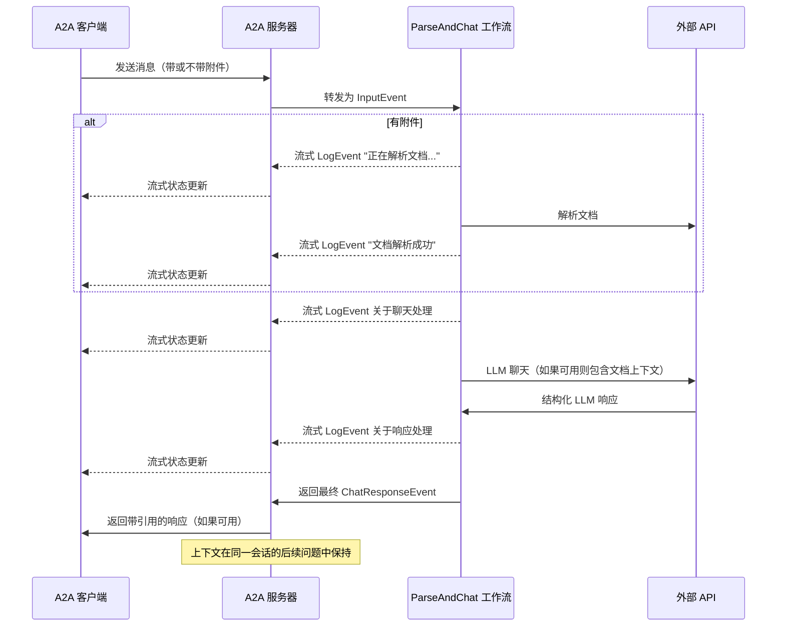

# LlamaIndex 文件聊天工作流与 A2A 协议

本示例演示了一个基于 [LlamaIndex Workflows](https://docs.llamaindex.ai/en/stable/understanding/workflows/) 构建的对话代理，并通过 A2A 协议暴露。它展示了文件上传和解析、支持多轮对话的对话交互、流式响应/更新和内联引用。

## 工作原理

本代理使用 LlamaIndex Workflows 和 Google Gemini 提供一个对话代理，可以上传文件、解析它们，并回答关于内容的问题。A2A 协议实现了与代理的标准化交互，允许客户端发送请求并接收实时更新。



## 主要特性

- **文件上传**: 客户端可以上传文件并解析它们以为聊天提供上下文
- **多轮对话**: 代理可以在需要时请求额外信息
- **实时流式传输**: 在处理过程中提供状态更新
- **推送通知**: 支持基于 webhook 的通知
- **对话记忆**: 在同一会话的交互中保持上下文
- **LlamaParse 集成**: 使用 LlamaParse 准确解析文件

**注意:** 本示例代理接受多模态输入，但在撰写本文时，示例 UI 仅支持文本输入。UI 将在未来变为多模态以处理此用例和其他用例。

## 前置要求

- Python 3.12 或更高版本
- [UV](https://docs.astral.sh/uv/)
- 访问 LLM 和 API 密钥（当前代码假设使用 Google Gen AI API）
- LlamaParse API 密钥（[免费获取](https://cloud.llamaindex.ai)）

## 设置和运行

1. 导航到示例目录：

   ```bash
   cd samples/python/agents/llama_index_file_chat
   ```

2. 创建包含 API 密钥的环境文件：

   ```bash
   echo "GOOGLE_API_KEY=your_api_key_here" >> .env
   echo "LLAMA_CLOUD_API_KEY=your_api_key_here" >> .env
   ```

3. 运行代理：

   ```bash
   # 在默认端口 10010 上基本运行
   uv run .

   # 在自定义主机/端口上
   uv run . --host 0.0.0.0 --port 8080
   ```

4. 在另一个终端中，运行 A2A [客户端](/samples/python/hosts/README.md)：

   ```bash
   cd samples/python/hosts/cli
   uv run . --agent http://localhost:10010
   ```

   下载要解析的文件，或链接到您自己的文件。例如：

   ```bash
   wget https://arxiv.org/pdf/1706.03762 -O attention.pdf
   ```

   然后输入类似以下内容：

   ```bash
   ======= 代理卡片 ========
   {"name":"Parse and Chat","description":"解析文件然后使用解析的内容作为上下文与用户聊天。","url":"http://localhost:10010/","version":"1.0.0","capabilities":{"streaming":true,"pushNotifications":true,"stateTransitionHistory":false},"defaultInputModes":["text","text/plain"],"defaultOutputModes":["text","text/plain"],"skills":[{"id":"parse_and_chat","name":"Parse and Chat","description":"解析文件然后使用解析的内容作为上下文与用户聊天。","tags":["parse","chat","file","llama_parse"],"examples":["这个文件讲了什么？"]}]}
   =========  开始新任务 ======== 

   您想向代理发送什么？(:q 或 quit 退出): 这个文件讲了什么？
   选择要附加的文件路径？（按回车跳过）: ./attention.pdf
   ```

## 技术实现

- **LlamaIndex Workflows**: 使用自定义工作流解析文件然后与用户聊天
- **流式支持**: 在处理过程中提供增量更新
- **可序列化上下文**: 在轮次之间保持对话状态，可以选择持久化到 redis、mongodb、磁盘等
- **推送通知系统**: 基于 webhook 的更新，带 JWK 认证
- **A2A 协议集成**: 完全符合 A2A 规范

## 限制

- 仅支持基于文本的输出
- LlamaParse 在前 10K 积分（约 3333 页，基本设置）内免费
- 内存基于会话且在内存中，因此在服务器重启之间不会持久化
- 将整个文档插入上下文窗口对于较大文件不可扩展。您可能希望部署向量数据库或使用云数据库来对一个或多个文件运行检索以实现有效的 RAG。LlamaIndex 与[大量向量数据库和云数据库](https://docs.llamaindex.ai/en/stable/examples/#vector-stores)集成。

## 示例

**同步请求**

请求：

```
POST http://localhost:10010
Content-Type: application/json

{
  "jsonrpc": "2.0",
  "id": 11,
  "method": "tasks/send",
  "params": {
    "id": "129",
    "sessionId": "8f01f3d172cd4396a0e535ae8aec6687",
    "acceptedOutputModes": [
      "text"
    ],
    "message": {
      "role": "user",
      "parts": [
        {
          "type": "text",
          "text": "这个文件讲了什么？"
        },
        {
            "type": "file",
            "file": {
                "bytes": "...",
                "name": "attention.pdf"
            }
        }
      ]
    }
  }
}
```

响应：

```
{
  "jsonrpc": "2.0",
  "id": 11,
  "result": {
    "id": "129",
    "status": {
      "state": "completed",
      "timestamp": "2025-04-02T16:53:29.301828"
    },
    "artifacts": [
      {
        "parts": [
          {
            "type": "text",
            "text": "这个文件是关于 XYZ... [1]"
          }
        ],
        "metadata": {
            "1": ["引用 1 的文本"]
        }
        "index": 0,
      }
    ],
  }
}
```

**多轮示例**

请求 - 序列 1：

```
POST http://localhost:10010
Content-Type: application/json

{
  "jsonrpc": "2.0",
  "id": 11,
  "method": "tasks/send",
  "params": {
    "id": "129",
    "sessionId": "8f01f3d172cd4396a0e535ae8aec6687",
    "acceptedOutputModes": [
      "text"
    ],
    "message": {
      "role": "user",
      "parts": [
        {
          "type": "text",
          "text": "这个文件讲了什么？"
        },
        {
            "type": "file",
            "file": {
                "bytes": "...",
                "name": "attention.pdf"
            }
        }
      ]
    }
  }
}
```

响应 - 序列 2：

```
{
  "jsonrpc": "2.0",
  "id": 11,
  "result": {
    "id": "129",
    "status": {
      "state": "completed",
      "timestamp": "2025-04-02T16:53:29.301828"
    },
    "artifacts": [
      {
        "parts": [
          {
            "type": "text",
            "text": "这个文件是关于 XYZ... [1]"
          }
        ],
        "metadata": {
            "1": ["引用 1 的文本"]
        }
        "index": 0,
      }
    ],
  }
}
```

请求 - 序列 3：

```
POST http://localhost:10010
Content-Type: application/json

{
  "jsonrpc": "2.0",
  "id": 11,
  "method": "tasks/send",
  "params": {
    "id": "130",
    "sessionId": "8f01f3d172cd4396a0e535ae8aec6687",
    "acceptedOutputModes": [
      "text"
    ],
    "message": {
      "role": "user",
      "parts": [
        {
          "type": "text",
          "text": "关于 X 事物呢？"
        }
      ]
    }
  }
}
```

响应 - 序列 4：

```
{
  "jsonrpc": "2.0",
  "id": 11,
  "result": {
    "id": "130",
    "status": {
      "state": "completed",
      "timestamp": "2025-04-02T16:53:29.301828"
    },
    "artifacts": [
      {
        "parts": [
          {
            "type": "text",
            "text": "X 事物是... [1]"
          }
        ],
        "metadata": {
            "1": ["引用 1 的文本"]
        }
        "index": 0,
      }
    ],
  }
}
```

**流式示例**

请求：

```
{
  "jsonrpc": "2.0",
  "id": 11,
  "method": "tasks/send",
  "params": {
    "id": "129",
    "sessionId": "8f01f3d172cd4396a0e535ae8aec6687",
    "acceptedOutputModes": [
      "text"
    ],
    "message": {
      "role": "user",
      "parts": [
        {
          "type": "text",
          "text": "这个文件讲了什么？"
        },
        {
            "type": "file",
            "file": {
                "bytes": "...",
                "name": "attention.pdf"
            }
        }
      ]
    }
  }
}
```

响应：

```
stream event => {"jsonrpc":"2.0","id":"367d0ba9af97457890261ac29a0f6f5b","result":{"id":"373b26d64c5a4f0099fa906c6b7342d9","status":{"state":"working","message":{"role":"agent","parts":[{"type":"text","text":"正在解析文档..."}]},"timestamp":"2025-04-15T16:05:18.283682"},"final":false}}

stream event => {"jsonrpc":"2.0","id":"367d0ba9af97457890261ac29a0f6f5b","result":{"id":"373b26d64c5a4f0099fa906c6b7342d9","status":{"state":"working","message":{"role":"agent","parts":[{"type":"text","text":"文档解析成功。"}]},"timestamp":"2025-04-15T16:05:24.200133"},"final":false}}

stream event => {"jsonrpc":"2.0","id":"367d0ba9af97457890261ac29a0f6f5b","result":{"id":"373b26d64c5a4f0099fa906c6b7342d9","status":{"state":"working","message":{"role":"agent","parts":[{"type":"text","text":"正在与 1 条初始消息聊天。"}]},"timestamp":"2025-04-15T16:05:24.204757"},"final":false}}

stream event => {"jsonrpc":"2.0","id":"367d0ba9af97457890261ac29a0f6f5b","result":{"id":"373b26d64c5a4f0099fa906c6b7342d9","status":{"state":"working","message":{"role":"agent","parts":[{"type":"text","text":"正在插入系统提示..."}]},"timestamp":"2025-04-15T16:05:24.204810"},"final":false}}

stream event => {"jsonrpc":"2.0","id":"367d0ba9af97457890261ac29a0f6f5b","result":{"id":"373b26d64c5a4f0099fa906c6b7342d9","status":{"state":"working","message":{"role":"agent","parts":[{"type":"text","text":"收到 LLM 响应，正在解析引用..."}]},"timestamp":"2025-04-15T16:05:26.084829"},"final":false}}

stream event => {"jsonrpc":"2.0","id":"367d0ba9af97457890261ac29a0f6f5b","result":{"id":"373b26d64c5a4f0099fa906c6b7342d9","artifact":{"parts":[{"type":"text","text":"这个文件讨论了 Transformer，一种完全基于注意力机制的新型神经网络架构，完全摒弃了循环和卷积 [1]。文档将 Transformer 与循环和卷积层进行了比较 [2]，详细说明了模型架构 [3]，并展示了机器翻译和英语成分解析任务的结果 [4]。"}],"metadata":{"1":["主要的序列转导模型基于复杂的循环或卷积神经网络，包括编码器和解码器。性能最佳的模型还通过注意力机制连接编码器和解码器。我们提出了一种新的简单网络架构 Transformer，完全基于注意力机制，完全摒弃循环和卷积。在两个机器翻译任务上的实验表明，这些模型在质量上更优，同时更具并行性，训练时间显著减少。我们的模型在 WMT 2014 英语到德语翻译任务上达到 28.4 BLEU，比现有最佳结果（包括集成）提高了超过 2 BLEU。在 WMT 2014 英语到法语翻译任务上，我们的模型在八个 GPU 上训练 3.5 天后建立了新的单模型最先进 BLEU 分数 41.8，这只是文献中最佳模型训练成本的一小部分。我们通过成功将其应用于英语成分解析（包括大量和有限训练数据）来证明 Transformer 很好地泛化到其他任务。"],"2":["在本节中，我们将自注意力层的各个方面与通常用于将一个可变长度符号表示序列 (x1, ..., xn) 映射到另一个等长序列 (z1, ..., zn) 的循环和卷积层进行比较，其中 xi, zi ∈ Rd，例如典型序列转导编码器或解码器中的隐藏层。在考虑使用自注意力的动机时，我们考虑三个期望。",""],"3":["# 3 模型架构"],"4":["# 6 结果"]},"index":0,"append":false}}}

stream event => {"jsonrpc":"2.0","id":"367d0ba9af97457890261ac29a0f6f5b","result":{"id":"373b26d64c5a4f0099fa906c6b7342d9","status":{"state":"completed","timestamp":"2025-04-15T16:05:26.111314"},"final":true}}
```

您可以看到工作流生成了一个带有内联引用的工件，这些引用的源文本包含在工件的元数据中。如果我们在同一会话中发送更多响应，代理将记住之前的消息并继续对话。

## 了解更多

- [A2A 协议文档](https://google.github.io/A2A/#/documentation)
- [LlamaIndex 工作流文档](https://docs.llamaindex.ai/en/stable/understanding/workflows/)
- [LlamaIndex 工作流示例](https://docs.llamaindex.ai/en/stable/examples/#agentic-workflows)
- [LlamaParse 文档](https://github.com/run-llama/llama_cloud_services/blob/main/parse.md)
- [Google Gemini API](https://ai.google.dev/gemini-api)
